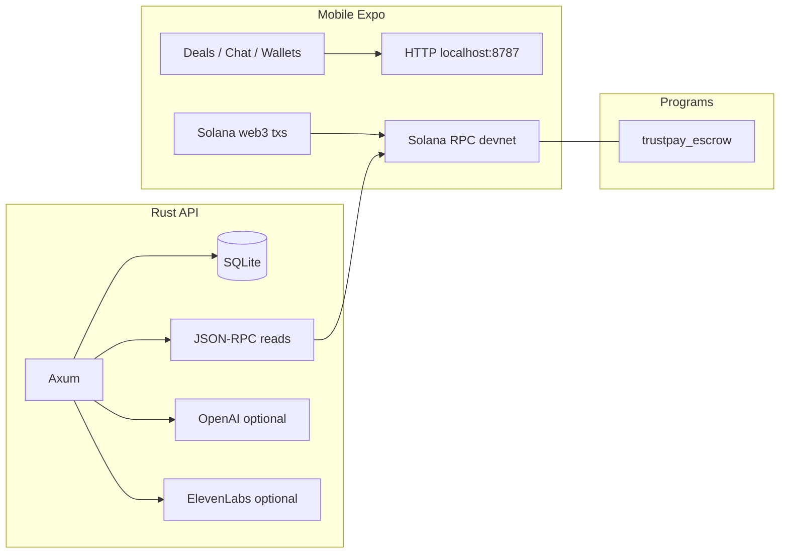

# TrustPay AI

TrustPay AI is an **end‑to‑end hackathon/demo stack** that combines:

- **React Native (Expo)** — escrow deals UI, messaging, fraud‑style chat analysis, synthetic “voice contract” playback, and **signed Solana transactions** against a devnet program.
- **Rust (Axum)** — SQLite persistence for deals and chat, optional OpenAI scoring, optional ElevenLabs TTS proxy, lightweight **Solana JSON‑RPC** reads (no heavyweight `solana-client`).
- **Solana / Anchor** — escrow program (`initialize`, `deposit`, `release_mutual`, dispute / arbiter flows) with PDAs documented in-repo.

Together, users can register a deal in the API, chat, run risk signals, optionally pull on‑chain escrow state via RPC, and **initialize / fund / release / dispute** escrows from the mobile app using on‑device key material.

---

## Repository layout

| Path | Purpose |
|------|---------|
| [`mobile/`](mobile/) | Expo app: REST client, wallets (Secure Store), Anchor‑style txs, explorers, AI/voice UX |
| [`backend/`](backend/) | Axum API, SQLite (`rusqlite`), `solana-pubkey` PDAs + `reqwest` JSON‑RPC |
| [`programs/trustpay_escrow/`](programs/trustpay_escrow/) | Anchor escrow program source |
| [`docs/`](docs/) | [`SOLANA_PROGRAM.md`](docs/SOLANA_PROGRAM.md), demo script, proposal notes |

Optional container build: [`docker-compose.yml`](docker-compose.yml), [`backend/Dockerfile`](backend/Dockerfile).

---

## High‑level architecture



1. **Off‑chain**: The app persists deal metadata + chat messages in SQLite via the Rust API (UUID deal id + random `deal_seed` hex per deal).
2. **On‑chain linkage**: Backend and mobile derive the same escrow/vault PDAs from `(program_id, buyer, seller, deal_seed)`. The API exposes PDAs and optional `getAccountInfo` snapshots when `include_chain=true`.
3. **Transactions**: The mobile app constructs Anchor‑compatible instructions and submits them via `@solana/web3.js`; the API does **not** hold user private keys.

---

## Functionality breakdown

### Rust API (`backend/`)

| Area | Behavior |
|------|-------------|
| **Deals** | `POST /api/deals` creates a deal row (buyer/seller/arbiter pubkeys, lamports, program id copy, random 8‑byte seed as hex); `GET /api/deals` lists summaries. |
| **Deal detail** | `GET /api/deals/:id` returns a bundle: persisted deal, last risk event, computed escrow/vault PDAs, explorer URLs, optional **chain** block when `?include_chain=true` (live `getAccountInfo` parse). |
| **Chat** | `GET/POST /api/deals/:id/messages` — messages persisted per deal. |
| **Risk** | `POST /api/deals/:id/analyze` — heuristic keyword signals always work; adds OpenAI‑structured rationale when `OPENAI_API_KEY` is set. |
| **Voice** | `POST /api/deals/:id/voice-contract` — constructs script from deal rows; returns base64 MP3 when `ELEVENLABS_API_KEY` set, otherwise script‑only payload. |
| **Solana** | `solana-pubkey` (with `curve25519`) for PDA derivation; **`reqwest`** for `getHealth`‑style RPC calls in tests and `getAccountInfo` in handlers. |

**Routing:** Axum path params use `:id` in code (e.g. `/api/deals/:id`); callers use paths like `/api/deals/<uuid>`.

See [`backend/.env.example`](backend/.env.example) for knobs (`HOST`, `PORT`, `DATABASE_PATH`, RPC, keys, program id).

### Mobile app (`mobile/`)

| Area | Behavior |
|------|----------|
| **Home** | Lists deals from API; entry to wallets and new deal. |
| **Wallets & keys** | Primary keypair (**buyer** path for init/deposit); optional **seller** secret for mutual release cosigning; optional **arbiter** for dispute resolution — stored with **Expo SecureStore** (development / hackathon UX; treat as hot keys). |
| **Create deal** | Posts to API; pre‑fills buyer with primary wallet pubkey when set. Seller/arbiter are pubkeys pasted or from another workflow. Amount in **lamports**. |
| **Deal room** | Chat, **Analyze**, **Voice contract**, toggles RPC bundle; **On‑chain escrow** buttons: Initialize → Deposit → Release / Dispute parties / Arbiter resolves. Status line reads escrow byte layout from RPC when account exists. |
| **Networking** | `expo.extra.trustpayApiUrl` for LAN device testing; emulator defaults `10.0.2.2:8787` (Android), `localhost:8787` (iOS sim). RPC / program override via `solanaRpcUrl` / `programId` in `app.json`. |

Solana helpers live under [`mobile/src/solana/`](mobile/src/solana/) (PDAs, instruction encoding aligned with Anchor discriminators).

### Anchor program (`programs/trustpay_escrow/`)

Documented instructions and seeds — see **`docs/SOLANA_PROGRAM.md`**. Typical flow:

1. **initialize** — buyer pays rent for escrow state + vault PDA accounts.  
2. **deposit** — buyer transfers `amount_lamports` into vault → **Funded**.  
3. **release_mutual** — buyer + seller sign together → seller receives lamports.  
4. **open_dispute** — buyer **or** seller while funded.  
5. **resolve_dispute** — arbiter sends funds to seller or refunds buyer.

After `anchor deploy`, keep **one canonical program id** in:

- `programs/trustpay_escrow` (via `declare_id!`),
- **`backend/.env`** → `TRUSTPAY_PROGRAM_ID`,
- **`mobile/app.json`** → `extra.programId`.

---

## Prerequisites

- **Rust** ([rustup](https://rustup.rs/)); on Windows use ** MSVC Build Tools** with **Desktop C++** so `cargo` links — see toolchain notes below.
- **Node.js** + npm for Expo.
- **Solana CLI + Anchor** — only needed to build/deploy/program tests (optional for API + mobile‑only mocks).

Docker can build/run the API without a local MSVC install — [`docker-compose.yml`](docker-compose.yml).

---

## Quick start

### 1. Backend API

```bash
cd backend
cp .env.example .env
# edit TRUSTPAY_PROGRAM_ID / keys if needed
cargo run
```

Defaults: **`http://0.0.0.0:8787`** (see `HOST`/`PORT` in `.env`). Health check: **`GET /health`** → `"ok"`.

### 2. Mobile (Expo)

```bash
cd mobile
npm install
npx expo start
```

- **Physical device:** set **`mobile/app.json` → `extra.trustpayApiUrl`** to your machine, e.g. `http://192.168.x.x:8787`.
- **Fund buyer** wallets on devnet before **Initialize / Deposit**.

### 3. Deploy escrow (optional)

```bash
# after installing Solana CLI + Anchor
cd programs/trustpay_escrow
solana config set --url devnet
anchor keys list   # or anchor keys sync
anchor build
anchor deploy --provider.cluster devnet
```

Mirror the deployed id into **`backend/.env`** and **`mobile/app.json`**.

---

## Windows / MSVC note

Rust needs `link.exe` from [Visual Studio Build Tools](https://visualstudio.microsoft.com/visual-cpp-build-tools/) (**Desktop development with C++**). Use **Developer PowerShell** / **x64 Native Tools** or restart the shell after install so `cargo build` succeeds.

---

## Testing

### Rust

```bash
cd backend
cargo test
cargo test -- --ignored   # optional: devnet program smoke read (needs TRUSTPAY_PROGRAM_ID + deployed program)
```

Integration tests (`tests/api_integration.rs`) spin up the full router against a temporary SQLite file. Lib tests cover **`solana_util`** PDA golden vectors (`@solana/web3.js`) and escrow account decoding.

### Mobile (Jest)

```bash
cd mobile
npm test
npm run test:watch
```

Pure Solana helpers are covered under **`src/solana/__tests__/`** (PDA parity with Rust fixture, layouts, instruction sizes).

---

## HTTP API summary

| Method & path | Description |
|----------------|-------------|
| `GET /health` | Liveness |
| `GET /api/deals` | List deals |
| `POST /api/deals` | Create deal (JSON body: buyer/seller/arbiter base58 strings, `amount_lamports`) |
| `GET /api/deals/:id` | Deal bundle (+ `?include_chain=true` merges live account parse) |
| `GET /api/deals/:id/messages` | List messages |
| `POST /api/deals/:id/messages` | Post message `{ sender, body }` |
| `POST /api/deals/:id/analyze` | Run risk tier on transcript |
| `POST /api/deals/:id/voice-contract` | Voice script (+ optional synthesized audio) |

---

## Dependencies (engineering notes)

- **Backend:** **`solana-pubkey`** with **`curve25519`** for `Pubkey::find_program_address` off‑chain — avoids pulling full `solana-client` / OpenSSL build complexity on constrained hosts.
- **Mobile:** `@solana/web3.js`, `buffer`, `react-native-get-random-values` shim in [`mobile/index.ts`](mobile/index.ts).

---

## Demo & docs

- Program & deploy: [`docs/SOLANA_PROGRAM.md`](docs/SOLANA_PROGRAM.md)  
- Scripted walkthrough: [`docs/DEMO_SCRIPT.md`](docs/DEMO_SCRIPT.md)

---

## License

Hackathon / educational use unless you declare otherwise elsewhere.
